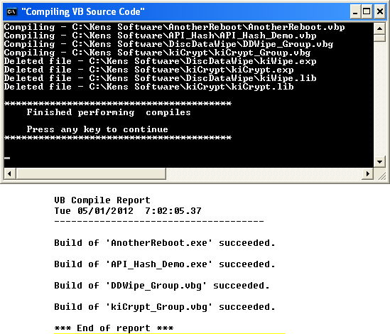

<div align="center">

## VB6 Mass compile


</div>

### Description

This may help some of you that have a need to perform mass compiles using Visual BASIC 6.0
 
### More Info
 


<span>             |<span>
---                |---
**Submitted On**   |
**By**             |[Kenaso](https://github.com/Planet-Source-Code/PSCIndex/blob/master/ByAuthor/kenaso.md)
**Level**          |Beginner
**User Rating**    |5.0 (10 globes from 2 users)
**Compatibility**  |VB 6\.0
**Category**       |[Miscellaneous](https://github.com/Planet-Source-Code/PSCIndex/blob/master/ByCategory/miscellaneous__1-1.md)
**World**          |[Visual Basic](https://github.com/Planet-Source-Code/PSCIndex/blob/master/ByWorld/visual-basic.md)
**Archive File**   |[](https://github.com/Planet-Source-Code/kenaso-vb6-mass-compile__1-73718/archive/master.zip)


### Source Code

```
After tweaking a support module that may effect several applications, you may want to do a mass compile. Below is an example of what I use. You may use VBP or VBG files.
Copy this code into an empty text file and rename the file to Compile.bat. You may store it anywhere since all entries have complete path information. I save mine in the root of C: drive.
When it is finished, the final report is also in the root drive and may be opened with any text editor (Notepad).
Within the output report, it should look something like this:
 VB Compile Report
 Wed 02/02/2011 4:56:11.80
 ----------------------------------------
 Build of 'API_Hash_Demo.exe' succeeded.
 Build of 'DefragAll.exe' succeeded.
If you have an error, Sometimes it is as simple as a bad reference to a module or variable. Other times, it will be like a COBOL error. You will have to backtrack from where the error was reported to where the error actually is located.
------- Copy code below here ---------
@ECHO OFF
CLS
TITLE "Compiling VB Source Code"
::=======================================================
::        VB Batch Compile
::     Kenneth Ives  kenaso@tx.rr.com
::=======================================================
cls
CD C:\
set FLDR=
set VBIDE=
set RPTFILE=
echo.
echo ***************************************************
echo  Close all active applications and press ENTER
echo.
echo  Press CTRL+C to terminate this application
echo  Press ENTER to begin compiling
echo ***************************************************
echo.
pause > nul
cls
set VBIDE="C:\Program Files\Microsoft Visual Studio\VB98\VB6.exe"
set RPTFILE="C:\Cmpl_Rpt.txt"
:: Double quotes added within batch file
set FLDR=C:\Kens Software
:: Create new report file
echo VB Compile Report > %RPTFILE%
echo %DATE% %TIME%   >> %RPTFILE%
echo ------------------------------------- >> %RPTFILE%
:: Navigate to source code base folder
CD %FLDR%\
:: Update file with project names. Works with VBG and VBP files.
:: Use as many projects as wanted.
echo Compiling - %FLDR%\AnotherReboot\AnotherReboot.vbp
%VBIDE% "%FLDR%\AnotherReboot\AnotherReboot.vbp" /make /out %RPTFILE%
echo Compiling - %FLDR%\API_Hash\API_Hash_Demo.vbp
%VBIDE% "%FLDR%\API_Hash\API_Hash_Demo.vbp" /make /out %RPTFILE%
echo Compiling - %FLDR%\DiscDataWipe\DDWipe_Group.vbg
%VBIDE% "%FLDR%\DiscDataWipe\DDWipe_Group.vbg" /make /out %RPTFILE%
echo Compiling - %FLDR%\kiCrypt\kiCrypt_Group.vbg
%VBIDE% "%FLDR%\kiCrypt\kiCrypt_Group.vbg" /make /out %RPTFILE%
:: Remove DLL debug files
del /S /Q "%FLDR%\*.exp"
del /S /Q "%FLDR%\*.lib"
echo. >> %RPTFILE%
echo *** End of report *** >> %RPTFILE%
CD C:\
echo.
echo ****************************************
echo   Finished performing compiles
echo.
echo   Press any key to continue
echo ****************************************
echo.
pause > nul
goto done
:done
set FLDR=
set VBIDE=
set RPTFILE=
CD C:\
cls
```

